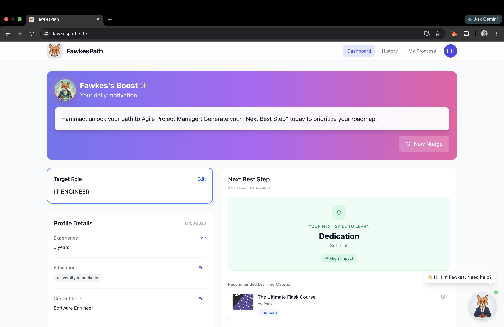
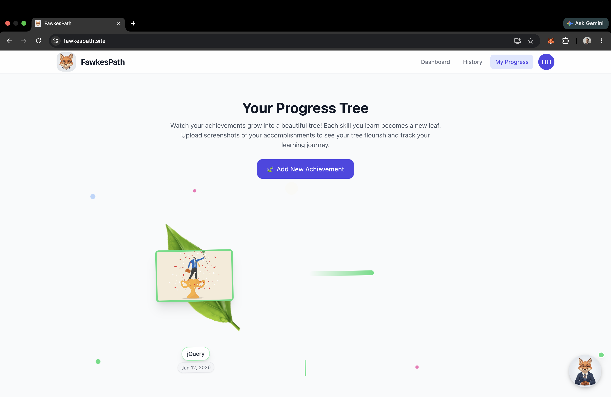
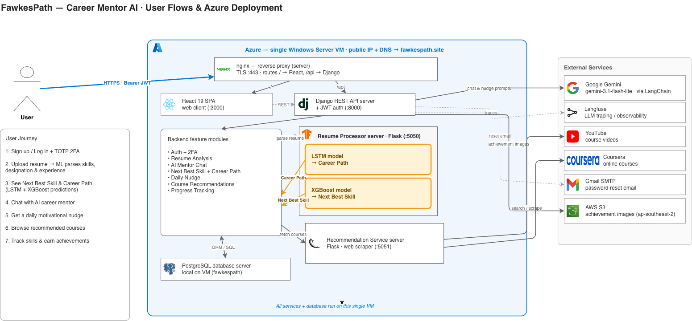

# Career Mentor AI — FawkesPath

**Portfolio-Based Guidance Through Intelligent Mentoring for Career Development**

Career Mentor AI (product name **FawkesPath**) is an MSCS research project: an
intelligent career-mentoring platform that turns a user's résumé into a
personalized growth plan. Upload your résumé and the system parses it, predicts
your **next best skill** and a multi-step **career pathway** toward a target
role, recommends courses and videos to get you there, sends a daily
motivational **nudge**, lets you **chat** with *Fawkes* (an on-screen avatar
mentor), and tracks your accomplishments as a growing **progress tree**.

> **FawkesPath** — find the path, one skill at a time.

---

## Screenshots

### Dashboard

The home view: target role, profile summary, daily nudge, next best step, and
recommended learning material — with Fawkes, the avatar mentor, on call.



### Progress Tree

Each achievement you log becomes a new leaf — a calm, visual record of your
learning journey.



### Architecture

The full system: a React SPA backed by a Django REST API that orchestrates two
Flask microservices and a set of external AI / content services.



---

## Features

- **Résumé understanding** — parse PDF/DOCX/TXT résumés and normalize skills,
  designations, education, and experience onto a standardized vocabulary.
- **Next Best Skill** — ML predictions of what to learn next (LSTM multi-output
  + XGBoost top-1 classifier).
- **Career Pathway** — a multi-step roadmap from your current role to a target
  role.
- **Course & video recommendations** — aggregated from Coursera (scraping) and
  YouTube (Data API v3).
- **Daily nudge** — an LLM-generated motivational message, refreshed every 24h.
- **AI career chat** — converse with Fawkes; context is built from your own
  résumé and goals.
- **Progress tree** — track achievements as leaves on a growing tree, with
  screenshots stored in S3.
- **Secure accounts** — JWT auth with optional TOTP two-factor authentication.

---

## Architecture Overview

```
                         ┌──────────────────────┐
   Browser  ───HTTPS───▶ │  React 19 SPA        │  web client (:3000 in dev)
                         └──────────┬───────────┘
                                    │ REST + JWT
                                    ▼
                         ┌──────────────────────┐
                         │  Django REST API      │  auth, persistence,
                         │  (backend)  :8000     │  AI orchestration
                         └─────┬───────┬────┬────┘
            parse / next-skill │       │    │ courses / videos
                               ▼       │    ▼
              ┌────────────────────┐   │   ┌─────────────────────────┐
              │ Resume Processor   │   │   │ Recommendation Service  │
              │ Flask  :5050       │   │   │ Flask  :5051            │
              │ LSTM + XGBoost     │   │   │ Coursera + YouTube      │
              └────────────────────┘   │   └─────────────────────────┘
                                       │
            chat / nudge prompts       ▼
                          Gemini LLM (LangChain; direct or AWS Lambda proxy)
                          Langfuse (LLM tracing) · AWS S3 (progress images)
                                       │
                                       ▼
                                 PostgreSQL
```

Everything is deployed on a **single Azure Windows Server VM** behind an nginx
reverse proxy (TLS, routing) — the React build, the Django API, both Flask
services, and a local PostgreSQL instance all run on that one host
(`fawkespath.site`). User-uploaded progress images are the only assets stored
off-box, in AWS S3.

---

## Components

This is a monorepo. Each component has its own detailed README:

| Component | Stack | Description |
| --- | --- | --- |
| [**Backend**](backend/README.md) | Django 6 + DRF | Central API — auth (JWT + TOTP 2FA), persistence, and orchestration of all AI features (chat, nudges, résumé insights, progress). |
| [**Frontend**](frontend/README.md) | React 19 + Tailwind | Single-page web client — dashboard, résumé upload, career chat, recommendations, and the progress tree. |
| [**Resume Processor**](resume_processor/README.md) | Flask + Keras/XGBoost | Résumé parsing/normalization and "next skill" prediction (LSTM + XGBoost models loaded in memory). |
| [**Recommendation Service**](recommendation_service/README.md) | Flask + BeautifulSoup | Course aggregation via a pluggable scraper factory (Coursera scraping, YouTube Data API v3). |

---

## Repository Layout

```
career-mentor-ai/
├── backend/                 Django REST API (see backend/README.md)
├── frontend/                React SPA (see frontend/README.md)
├── resume_processor/        Flask ML service (see resume_processor/README.md)
├── recommendation_service/  Flask scraper service (see recommendation_service/README.md)
├── nginx-windows.conf       nginx reverse-proxy config for the Azure VM
├── docs/images/             Screenshots & diagrams used in this README
└── README.md                You are here
```

---

## Getting Started

Each service runs independently and has setup instructions in its own README.
For a full local stack, start them in this order:

1. **PostgreSQL** — create a database for the backend.
2. **Resume Processor** (`:5050`) — see [resume_processor/README.md](resume_processor/README.md).
3. **Recommendation Service** (`:5051`) — see [recommendation_service/README.md](recommendation_service/README.md).
4. **Backend** (`:8000`) — see [backend/README.md](backend/README.md); point it at PostgreSQL and the two Flask services.
5. **Frontend** (`:3000`) — see [frontend/README.md](frontend/README.md); set `REACT_APP_API_BASE_URL` to the backend.

Configuration for every service is supplied through environment variables; see
each README for the required keys (LLM/Gemini, Langfuse, AWS S3, YouTube Data
API, SMTP, etc.).

---

## Tech Stack at a Glance

- **Frontend:** React 19, React Router v7, Redux Toolkit, Tailwind CSS, Axios.
- **Backend:** Django 6, Django REST Framework, SimpleJWT, pyotp, PostgreSQL.
- **ML service:** Flask, TensorFlow/Keras (LSTM), XGBoost, scikit-learn, pandas,
  resume-parser (Tika / pdfminer / spaCy).
- **Recommendations:** Flask, requests, BeautifulSoup, YouTube Data API v3.
- **AI & infra:** Gemini via LangChain, Langfuse observability, AWS S3, AWS
  Lambda (LLM fallback proxy), nginx, Azure VM.

---

## About

This repository accompanies an MSCS research project on portfolio-based career
guidance through intelligent mentoring. It is intended for research and
demonstration purposes.
